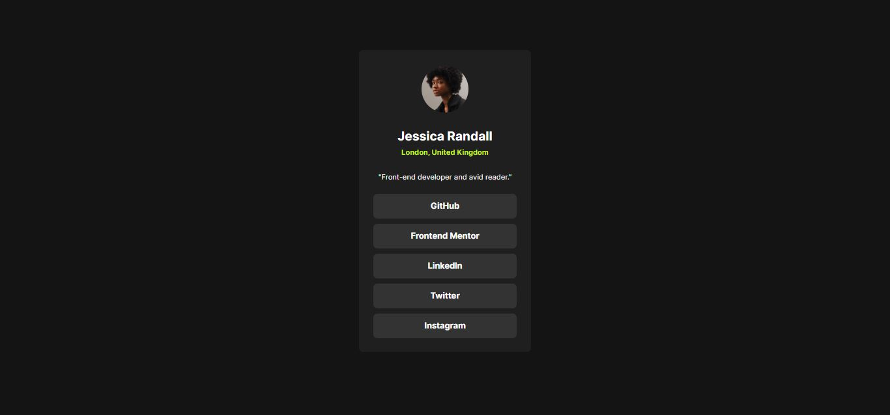

# Frontend Mentor - Solución del perfil de enlaces sociales

Esta es una solución al desafío [Social links profile challenge on Frontend Mentor](https://www.frontendmentor.io/challenges/social-links-profile-UG32l9m6dQ).
Los desafíos de Frontend Mentor te ayudan a mejorar tus habilidades de codificación mediante la construcción de proyectos realistas.

## Tabla de contenidos

- [Descripcion](#descripcion)
    -[El desafio](#el-desafio)
    -[Captura de pantalla](#captura-de-pantalla)
    -[Enlaces](#enlaces)
-[Mi proceso](#mi-proceso)
    -[Tecnologias utilizadas](#tecnologias-utilizadas)
    -[Lo que aprendi](#lo-que-aprendi)
    -[Desarrollo continuo](#desarrollo-continuo)
    -[Recursos utiles](#recursos-utiles)
-[Autor](#autor)
    -[Reconocimientos](#reconocimientos)

## Descripción

### El desafío
Los usuarios deberían poder:

Ver los estados de hover y foco para todos los elementos interactivos en la página.
### Captura de pantalla

### Enlaces

URL de la solución: [GitHub](https://github.com/ReyCrisGit/Social-links-profile.git)
URL del sitio en vivo: 

## Mi proceso

### Tecnologías utilizadas

-Marcado semántico HTML5
-Propiedades personalizadas de CSS
-Flexbox

### Lo que aprendí

Aprendí a utilizar el pseudo-elemento :root para declarar variables globales en CSS.

### Desarrollo continuo

Saber cuando usar y no usar FlexBox

### Recursos útiles

Los videos de [Jordan Alexander](https://www.youtube.com/@AlexCGDesign)

## Autor

Sitio web - [Cristian Barrios](https://github.com/ReyCrisGit)
Frontend Mentor - [Cristian Barrios](https://www.frontendmentor.io/profile/ReyCrisGit)
Reconocimientos
Al Instructor Jordan Alexander